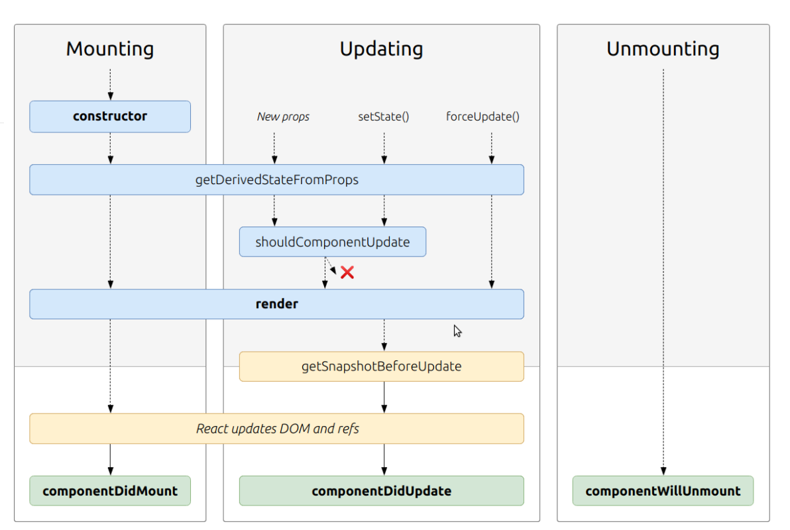

## component lifecycle events:


  The methods that you are able to use on React components **(classes or functions.)**

  methods can be called during the **lifecycle of a component,** and they allow you to update the UI and application states.

## events are : 

**1-Mounting** : When an instance of a component is being created and inserted into the DOM.
 example :

* constructor()
The constructor for a React component is called before it is mounted.


**2-Updating** Anytime a component is updated or state changes then it is rerendered.


**3-Unmounting** : The final phase of the lifecycle if called when a component is being **removed from the DOM**

example :  componentWillUnmount

**These events have lead to a lot of bugs and unintended side effects, so in React 17 these will no longer be able to be used without the UNSAFE tag.**


## UNSAFE Lifecycle Events :
Instead of `componentWillMount` use `ComponentDidMount`.
Instead of `componentWillReceiveProp`s use static `getDerivedStateFromProps.`


## What is a Linked List?
A linked list is a linear data structure where each element is a separate object usually called a node. 

questions: 
1-Based off the diagram, what happens first, the ‘render’ or the ‘componentDidMount’? 

**the render will happen first**


2-What is the very first thing to happen in the lifecycle of React?
 **mounting**


 3- put the following things in the order that they happen ?
```
 constructor()
 render()
 componentDidMount()
 React Updates()
 componentWillUnmount()
```

## React Bootstrap:
 ( front-end framework Rebuilt for React.)
React-Bootstrap replaces the Bootstrap JavaScript

Each component is implemented with accessibility in mind. The result is a set of accessible-by-default components, over what is possible from plain Bootstrap.
example:
```
[
  'primary',
  'secondary',
  'success',
  'danger',
  'warning',
  'info',
  'light',
  'dark',
].map((variant, idx) => (
  <Alert key={idx} variant={variant}>
    This is a {variant} alert—check it out!
  </Alert>
));
```

## Netlify

 is an all-in-one platform for automating modern web projects.
 **used for hosting react apps** .

  Integrate dynamic functionality like serverless functions, user authentication, and form handling as your projects grow.


## state vs props : 
### 1-What types of things can you pass in the props?
you can pass anything in props even function 


### 2-What is the big difference between props and state?
props are read only and used for passing data from parent to child 
while state is only for the component (locally)


### 3-When do we re-render our application?
 when we change the state or update it 

### 4-What are some examples of things that we could store in state?
array boolean strings 
