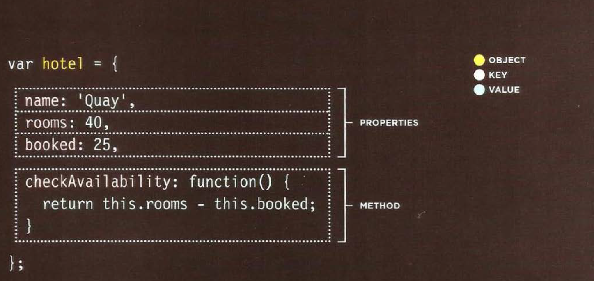

# Understanding The Problem Domain Is The Hardest Part Of Programming

reason :  because you can’t really see what you are trying to build very clearly.

  **Programming is easy if you understand the problem domain**
  You can often make the problem domain easier by cutting out cases and narrowing your focus to a particular part of the problem,*The other* choice is to become better at understanding problem domains. 

  **It is much more expensive and time consuming to do things over than it is to do them right the first time**.


# objects :

Objects group together a set of variables and functions to create a model of a something you would recognize from the real world.

**IN AN OBJECT: VARIABLES BECOME
KNOWN AS PROPERTIES**

**IN AN OBJECT: FUNCTIONS BECOME
KNOWN AS METHODS**

**key** : is the name of properties An object cannot have two keys with the same name. This is
because keys are used to access their corresponding values.

## creating an object :
using letiral notation (the easiest and most populer)


  
  **accessing object** :
  ```
  var hotel = {
name: 'Quay',
rooms : 40,
booked: 25,
checkAvailability: function() {
return this.rooms - this.booked;
}
} ;
JAVASCRIPT
var elName = document .getElementByld('hotelName');
elName.textContent =hotel .name;
var elRooms = document.getElementByid{'rooms');
elRooms .textContent = hotel .checkAvailability();
```


# The Document Object Model (DOM) :
how browsers should create a model of an HTML page and how JavaScript can access and update the contents of a web page while it is in the browser window.

Any changes made to the DOM tree are reflected in the browser.


**methods that finds elemnts in the dom tree are called  DOM queries**

**The DOM is neither part of HTML, nor part of JavaScript; it is a separate set of rules .**

  **The DOM is called an object model because the model (the DOM tree) is made of objects.**

  ## As a browser loads a web page, it creates a model of that page. The model is called a DOM tree, and it is stored in the browsers' memory. It consists of four main types of nodes: 
   Each node is an object with methods and properties

  **1-THE DOCUMENT NODE :**
  represents the entire page ,It is the starting point for all visits to the DOM tree.


  **2-ELEMENT NODES :**
  (Every node is a descendant of the document node.)

**3-ATTRIBUTE NODES :** Attribute nodes are not children of the element thar carries them; they are part of that element.

**4-TEXT NODES :**
Once you have accessed an element node, you can then reach the text within that element.

Text nodes cannot have children

**the text node is always a new branch of the DOM
tree, and no further branches come off of it.**


## Accessing and updating the DOM tree involves two steps:
1: Locate the node that represents the element you want to work with.

2: Use its text content, child elements, and attributes.


**1: Locate/ACCESS THE ELEMENTS :**

*

You can select element nodes by their id or class attributes, by tag name, or using CSS selector syntax.

1- `getElementByld('id' )`

2-`querySelector('css selector')`

3-TRAVERSING BETWEEN ELEMENT NODES (You can move from one element node to a related element node.

Whenever a DOM query can return more than one
node, it will always return a **Nodelist.**

- `parentNode`
Selects the parent of the current element node
- `previousSibl ing / nextSibl ing`
- `firstChild / lastChild`


### + **There are three common ways to select multiple elements:(node list) **

The order in which the element nodes are stored in a Node List is the same order that they appeared in the HTML page.
Each node is given an index number (a number that starts
at zero, just like an **array (but they are not actually arrays; they are a type of object called a *collection*.)**).

## Nodelist has properties and methods :
1-The `length` property
2-The `item()` method returns a specific node from
the Nodelist when you tell it the index number.

**live Nodelist :** when your script updates the page, the Nodelist is updated at the same time.

**static Nodelist :** when your script updates the page, the NodeList is not updated to reflect the changes made by the script.
(methods that begin `querySelector`.(which use CSS selector syntax) return static Nodelists.)

### + **STEP 1 :SELECT AN INDIVIDUAL ELEMENT NODE :**


1- `getElementsByClassName('class')`

2- `getElementsByTagName('tagName')`

3-`querySelectorAll('css selector')`


### + **STEP 2: WORK WITH THOSE ELEMENTS :**
From an element node, you can access and update its content using properties such as textContent and `innerHTML` or using DOM manipulation techniques.

+ ACCESS/ UPDATE TEXT NODES

  `nodeValue` This property lets you access or
update contents of a text node.

+ WORK WITH HTML CONTENT :

1- `innerHTML`
2-`textContent`
3-`create Element()`

`createTextNode()`

`appendChild()` / `removeChild()`
**This is called DOM manipulation.**
 + ACCESS OR UPDATE ATTRIBUTE VALUES :

 1-`className /id`

 2-
 ```
 hasAttribute()   //checks if an attributeexists
getAttribute()    // gets its value.
setAttribute()  //updates the value.
removeAttribute()  // removes an attribute
```


### LOOPING THROUGH A NODELIST :
If you want to apply the same code to numerous elements, looping through a Nodelist is a powerful technique.


## TRAVERSING THE DOM :
When you have an element node, you can select another element in relation to it.
1- `parentNode`

2-`previousSibling`/ `nextSibling`

3-`firstChild` / `astChild`


Traversing the DOM can be difficult because some browsers add a text node whenever they come across whitespace between elements,most popular ways to address this kind of problem is
to use a **JavaScript library such as jQuery**


## HOW TO GET/UPDATE ELEMENT CONTENT :
+ **Navigate to the text nodes.** :
 This works best when the element contains only text, no other elements.

 The text node has a property called `nodeValue` which returns
the text in that text node.

 + **Work with the containing element.:** This allows
you to access its text nodes and child elements.
It works better when an element has text nodes
and child elements that are siblings.
 `textContent`


 ## adding or removing HTML content:

**1- innerHTML** 
the i nnerHTML property will get the content of an
element and return it as one long string, including any markup that the element contains.
  

  **2- DOM manipulation**

+ **adding**

  It involves three steps:
  ```
  createEl ement () // it is not yet part of the DOM tree.
  createTextNode() // This provides the content for the The element
  appendChild()  //  allows you to specify which element you want this node  added to, as a child of it.```
  


## example:


 ``` // Create a new element and store it in a variable.

var newEldocument .createElement( ' li ' );

// Create a text node and store it in a variable.

var newText document.createTextNode( ' quinoa ' );

// Attach the new t ext node to t he new element.

newEl .appendChi ld(newText);

// Find t he pos i ti on where the new element should be added.

var position = document.getElementsByTagName('ul ')[O];

// Insert the new element into its position .

position .appendChild(newEl);
```


+ **REMOVING AN ELEMENT**

`removeChi1d ()`


## If you add HTML to a page using innerHTML (or several jQuery methods), you need to be aware of Cross-Site Scripting Attacks or XSS; otherwise, an attacker could gain access to your users' accounts.


## Make sure that your users can only input characters they need to use and limit where this content will be shown on the page.

