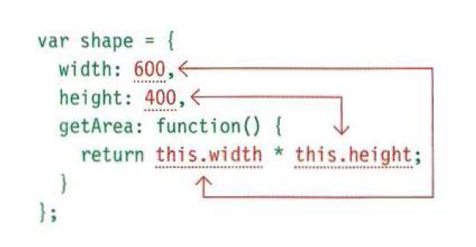

# Domain modeling 
is the process of creating a conceptual model in code for a specific problem


1-The new keyword instantiates (i.e. creates) an object.

2-The constructor function initializes properties inside that object using the this variable.

3- The object is stored in a variable for later use.

summary:
1- When modeling a single entity that'll have many instances, build self-contained objects with the same attributes and behaviors.

2- Model its attributes with a constructor function that defines and initializes properties.

3- Model its behaviors with small methods that focus on doing one job well.
4- Create instances using the new keyword followed by a call to a constructor function.

5- Store the newly created object in a variable so you can access its properties and methods from outside.

6- Use the this variable within methods so you can access the object's properties and methods from inside.

# Table :
A table represents information in a grid format.


## Basic Table Structure :

1- table  tag 

The `<table>` element is used
to create a table. The contents
of the table are written out row
by row.

2- table row 
You indicate the start of each
row using the opening `<tr>` tag

3- table data

Each cell of a table is
represented using a `<td>`
element. 

**The `<th>` element is used just like the `<td>` element but its purpose is to represent the heading for either a column or a row.**

## Spanning ColumnS :
The `colspan` attribute can be
used on a `<th>` or `<td>` element and indicates how many columns that cell should run across.


## spanning rows :
The `rowspan` attribute can be
used on a `<th>` or `<td> `element to indicate how many rows a cell should span down the table.

```
<table>
<tr>
<th></th>
<th>ABC</th>
<th>BBC</th>
<th>CNN</th>
</tr>
<tr>
<th>6pm - 7pm</th>
<td rowspan="2">Movie</td>
<td>Comedy</td>
<td>News</td>
</tr>
<tr>
<th>7pm - 8pm</th>
<td>Sport</td>
<td>Current Affairs</td>
</tr>
</table>
```


 ## in long tables:
**`<thead>`** The headings of the table should sit inside the `<thead>` element.

**`<tbody>`** The body should sit inside the <tbody> element.

**`<tfoot>`**
The footer belongs inside the
<tfoot> elements.


# creating an object constructor notation:

**1- create an empty object** 
first you use the `new` keyword  and the `object()` constructor .

**2- adding properties nad methods using the `.` notation.

**3- update values or properties**

use dot notation or square brackerts to update a value
or to add properties
**you can use square brackets when you are not inside a function**
```
hotel.name='park'
hotel['name']='park'
```

**use the `delete` keyword to delete an attribute.

## Object constructors can use a function as a template for creating objects:


**The name of a constructor function usually begins
with a capital letter**

**The `uppercase letter` is supposed to help remind
developers to use the new keyword when they create
an object using that function**

## you create instances of the object using the constructor function the `new` keyword followed by a call to the function creates a new object the properties of each object are given as arguments to the dunction


## THIS keyword
The keyword this is commonly used inside functions and objects
Where the function is declared alters what this means. It always refers
to one object, usually the object in which the function operates.


**1-When a function is defined inside an object, it
becomes a method. In a method, `this `refers to the
containing object.**





If you were creating several objects using an
object constructor (and each shape had different
dimensions), this would refer to the individual
instance of the new object you are creating.


### MULTIPLE OBJECTS:

When you need to create multiple objects within the
same page, you should use an object constructor to
provide a template for the objects.
```
function Hotel (name, rooms)
this .name = name;
this.rooms = rooms;
```
You then create instances of the object using the `new`
keyword and then a call to the constructor function.
```
var hotell =new Hotel ( ' Quay', 40);
var hotel2 = new Hotel ( ' Park ' , 120);
```

## built-in objects :
You access their properties or methods using dot notation


+ THE BROWSER OBJECT MODEL:
 
1-THE WINDOW OBJECT : represents the current browser window or tab.


2-STRING OBJECT


3-NUMBER OBJECT


4-MATH OBJECT


5- date objects 

